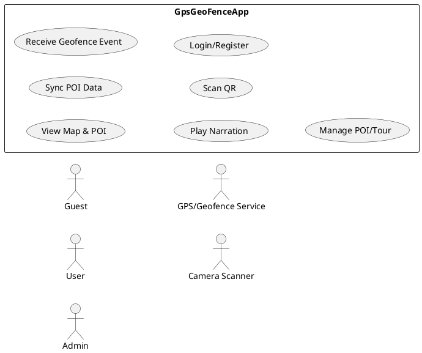
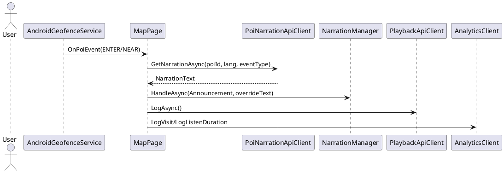

# UML Design Input - GpsGeoFenceApp

> Tài liệu đầu vào để vẽ UML (Use Case, Sequence, Activity, Class) theo đúng hệ thống đang chạy.

---

## 1) Mục tiêu tài liệu

- Chuẩn hóa mô tả chức năng hiện có của dự án.
- Mô tả luồng hoạt động thực tế của từng chức năng.
- Chỉ rõ `folder/file` liên quan để truy source nhanh khi vẽ UML.
- Dùng như "single source of truth" cho vibe code + thiết kế hệ thống.

## 2) Bức tranh hệ thống hiện tại

### 2.1 Thành phần chính

- **Mobile App (.NET MAUI):** `Application`
- **Backend API (ASP.NET Core Minimal API):** `MapApi`
- **Client storage:** SQLite trên mobile (`PoiDatabase`)
- **Server storage:** SQL Server (EF Core `AppDb`)
- **Tích hợp ngoài:** GPS/Geofence Android, Camera QR (ZXing), TTS/Audio, Translator

### 2.2 Actors chính cho UML Use Case

- **Guest User** (khách vãng lai)
- **Logged-in User** (người dùng đã đăng nhập)
- **Admin/CMS** (quản trị dữ liệu POI/tour, qua API admin)
- **System Services** (GPS, Geofence engine, Camera, Translator, Analytics logger)

---

## 3) Danh sách chức năng đang dùng (Functional Inventory)

### F01. Xem bản đồ và POI

- Hiển thị map, pin, vòng geofence, chi tiết POI.
- Cho phép reset map, locate me, zoom in/out.
- Lọc POI theo tour.

### F02. Đồng bộ dữ liệu POI (Sync)

- App gọi API kiểm tra version.
- Nếu version thay đổi thì tải danh sách POI mới và upsert SQLite.
- Auto sync định kỳ + manual sync từ toolbar.

### F03. Geofence theo vị trí

- Đăng ký geofence Android cho danh sách POI.
- Nhận event `ENTER/EXIT/DWELL`, lọc bằng gate chống spam.
- Kích hoạt highlight + narration + analytics khi event hợp lệ.

### F04. Narration / Audio thuyết minh

- Ưu tiên phát file audio nếu có.
- Fallback sang TTS theo ngôn ngữ chọn.
- Lấy nội dung narration theo `poi + lang + eventType`, có cache local.

### F05. Đa ngôn ngữ hiển thị và dịch

- User chọn ngôn ngữ trên map page.
- Tên/mô tả POI có thể dịch động qua Translator client.
- Narration backend có fallback ngôn ngữ về `vi-VN`.

### F06. Quét QR

- Mở camera, quét QR và parse theo nhiều format.
- Nếu QR là POI của hệ thống -> phát narration POI.
- Nếu QR là URL -> hỏi người dùng rồi mở browser.

### F07. Đăng nhập / đăng ký

- Register account mới.
- Login nhận JWT token.
- Lưu thông tin user trong `Preferences`.

### F08. Analytics / Playback / History

- Ghi log visit, route, listen duration.
- Ghi playback/history từ hành vi nghe thuyết minh.

### F09. Quản trị dữ liệu POI/Tour (API)

- Endpoint admin cho danh sách/sửa/xóa mềm POI.
- Endpoint sync tours trả về danh sách tour + poi ids.
- Endpoint dịch hàng loạt POI đa ngôn ngữ.

---

## 4) Luồng hoạt động chính (UML-ready)

### 4.1 Luồng mở app vào bản đồ (Activity/Sequence)

1. User mở `MapPage`.
2. `MapPage.InitializeMapAsync()` khởi tạo SQLite.
3. Gọi `PoiSyncService.SyncOnceAsync()`.
4. Nạp POI từ local DB -> render pin + geofence circle.
5. Nạp tours -> bind `TourPicker`.
6. Xin quyền location.
7. Bật tracking vị trí + đăng ký geofence.
8. Bắt đầu auto sync định kỳ.

### 4.2 Luồng geofence event -> narration (Sequence)

1. Android geofence gửi transition (`ENTER/EXIT/DWELL`).
2. `AndroidGeofenceService` map event sang `OnPoiEvent`.
3. `MapPage.OnGeofenceEvent()` nhận event.
4. Lấy narration text theo `poi/lang/event`.
5. `NarrationManager.HandleAsync()` phát audio hoặc TTS.
6. Gửi log playback + analytics visit/duration.

### 4.3 Luồng QR scan (Activity/Sequence)

1. User vào `QrScanPage`, camera bắt đầu detect.
2. QR detected -> `HandleQrValueAsync(raw)`.
3. Nhánh A: parse được `poi_id` -> load POI local -> phát narration.
4. Nhánh B: là URL -> confirm -> mở browser.
5. Nhánh C: invalid -> báo lỗi -> resume scan.

### 4.4 Luồng sync dữ liệu POI (Sequence)

1. `PoiSyncService` gọi `GET /api/v1/sync/version`.
2. So với version local trong `Preferences`.
3. Nếu khác -> `GET /api/v1/pois`.
4. Upsert từng POI vào SQLite (`PoiDatabase.SaveAsync`).
5. Lưu version mới + last sync timestamp.

### 4.5 Luồng đăng nhập (Sequence)

1. User nhập username/password.
2. Mobile gọi `POST /api/v1/auth/login`.
3. Backend verify hash BCrypt + tạo JWT.
4. Trả token + user info.
5. App lưu `Preferences` và cập nhật UI profile/menu.

---

## 5) Mapping chức năng -> folder/file

### 5.1 Mobile App (`Application`)

| Chức năng                                        | Folder/File chính                                                                                                                                                                                    |
| ------------------------------------------------ | ---------------------------------------------------------------------------------------------------------------------------------------------------------------------------------------------------- |
| DI, service registration, HTTP client            | `Application/MauiProgram.cs`                                                                                                                                                                         |
| Routing shell + menu user/logout                 | `Application/AppShell.xaml`, `Application/AppShell.xaml.cs`                                                                                                                                          |
| Bản đồ + geofence + tour + narration + analytics | `Application/Pages/MapPage.xaml`, `Application/Pages/MapPage.xaml.cs`                                                                                                                                |
| QR scan camera                                   | `Application/Pages/QrScanPage.xaml`, `Application/Pages/QrScanPage.xaml.cs`                                                                                                                          |
| Login/Register UI                                | `Application/Pages/LoginPage.xaml.cs`, `Application/Pages/RegisterPage.xaml.cs`                                                                                                                      |
| SQLite POI local                                 | `Application/Data/PoiDatabase.cs`                                                                                                                                                                    |
| Sync engine                                      | `Application/Services/Sync/PoiSyncService.cs`, `Application/Data/SyncMetadataRepository.cs`                                                                                                          |
| Narration orchestration                          | `Application/Services/Narration/NarrationManager.cs`, `Application/Services/Narration/INarrationManager.cs`                                                                                          |
| Audio playback/cache                             | `Application/Services/Audio/IAudioPlayer.cs`, `Application/Services/Audio/AndroidAudioPlayer.cs`, `Application/Services/Audio/AudioCache.cs`                                                         |
| API client POI                                   | `Application/Services/Api/PoiApiClient.cs`                                                                                                                                                           |
| API client narration                             | `Application/Services/Api/PoiNarrationApiClient.cs`                                                                                                                                                  |
| API client auth                                  | `Application/Services/Api/AuthApiClient.cs`                                                                                                                                                          |
| API client tour                                  | `Application/Services/Api/TourApiClient.cs`                                                                                                                                                          |
| API client analytics/playback/translator         | `Application/Services/Api/AnalyticsClient.cs`, `Application/Services/Api/PlaybackApiClient.cs`, `Application/Services/Api/TranslatorClient.cs`                                                       |
| Android geofence + location                      | `Application/Platforms/Android/Services/AndroidGeofenceService.cs`, `Application/Platforms/Android/Services/AndroidLocationService.cs`, `Application/Platforms/Android/GeofenceBroadcastReceiver.cs` |
| Domain model POI/tour/dto                        | `Application/Models/POI.cs`, `Application/Models/TourDto.cs`, `Application/Models/PoiDto.cs`, `Application/Models/PoiNarrationDto.cs`                                                                |

### 5.2 Backend API (`MapApi`)

| Chức năng                             | Folder/File chính                                                                                                                                                                                   |
| ------------------------------------- | --------------------------------------------------------------------------------------------------------------------------------------------------------------------------------------------------- |
| Startup, middleware, endpoint mapping | `MapApi/Program.cs`                                                                                                                                                                                 |
| EF DbContext + schema mapping         | `MapApi/Data/AppDb.cs`                                                                                                                                                                              |
| Model chính                           | `MapApi/Models/Poi.cs`, `MapApi/Models/PoiLanguage.cs`, `MapApi/Models/PoiMedia.cs`, `MapApi/Models/Tour.cs`, `MapApi/Models/Users.cs`, `MapApi/Models/HistoryPoi.cs`, `MapApi/Models/Analytics.cs` |
| POI management services               | `MapApi/Services/PoiManagementService.cs`                                                                                                                                                           |
| Translation services/background       | `MapApi/Services/TranslatorClient.cs`, `MapApi/Services/TranslationBackgroundService.cs`                                                                                                            |
| Controller bổ sung                    | `MapApi/Controllers/PoiController.cs`, `MapApi/Controllers/PoiMediaController.cs`, `MapApi/Controllers/QrController.cs`, `MapApi/Controllers/TranslatorController.cs`                               |
| Migrations EF                         | `MapApi/Migrations/`*                                                                                                                                                                               |

---

## 6) Gợi ý phạm vi cho từng UML

### 6.1 Use Case Diagram (Nên vẽ trước)

- **Guest User:** xem map, chọn ngôn ngữ, quét QR, nghe narration.
- **Logged-in User:** thêm login/logout, ghi history cá nhân.
- **Admin:** quản lý POI/tour/media, chạy dịch hàng loạt.
- **External Systems:** GPS, Geofence, Camera, Translator API.

### 6.2 Sequence Diagram ưu tiên

- `MapPage init + sync + register geofence`
- `Geofence ENTER -> narration + analytics`
- `QR scan -> parse -> POI narration hoặc open URL`
- `Login -> JWT`

### 6.3 Activity Diagram ưu tiên

- Activity "User visiting POI"
- Activity "Sync decision by version"
- Activity "QR handling with 3 branches"

### 6.4 Class Diagram phạm vi

- **Mobile domain/services:** `MapPage`, `PoiSyncService`, `NarrationManager`, `PoiDatabase`, `AndroidGeofenceService`, `PoiApiClient`, `PoiNarrationApiClient`
- **Backend entities:** `Poi`, `PoiLanguage`, `PoiMedia`, `Tour`, `TourPoi`, `Users`, `HistoryPoi`, `Analytics`*
- **Quan hệ chính:** `Poi 1-n PoiLanguage`, `Poi 1-n PoiMedia`, `Tour n-n Poi (qua TourPoi)`, `Users 1-n HistoryPoi`

---

## 7) PlantUML starter snippets (để vẽ nhanh)

### 7.1 Use Case Starter

### 7.2 Sequence Starter (Geofence -> Narration)

---

## 8) Checklist khi cập nhật tài liệu UML

- Chức năng mới có thêm vào mục Functional Inventory.
- Luồng mới có cập nhật vào section Luồng hoạt động.
- Có map file nguồn tương ứng trong bảng folder/file.
- Diagram draft khớp với flow thực tế trong code.

