# Thiết Kế PlantUML Cho Các Module Trọng Tâm (GpsGeoFenceApp)

Tài liệu này cung cấp mã nguồn **PlantUML** chi tiết cho các luồng hoạt động (Activity) và biểu đồ tuần tự (Sequence) của 6 module mà bạn đã yêu cầu. Bạn có thể chép trực tiếp các đoạn code nằm trong block ` ```plantuml ` vào các công cụ như [PlantText](https://www.planttext.com/), IDE Plugin (VS Code PlantUML), hoặc máy chủ PlantUML của bạn để kết xuất ra hình ảnh.

---

## 1. Module 4: POI Data Management (Sync + Local DB)

### Activity Diagram
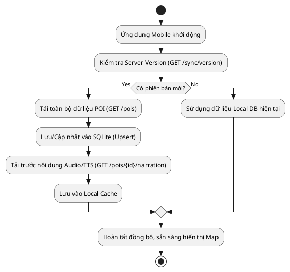

### Sequence Diagram
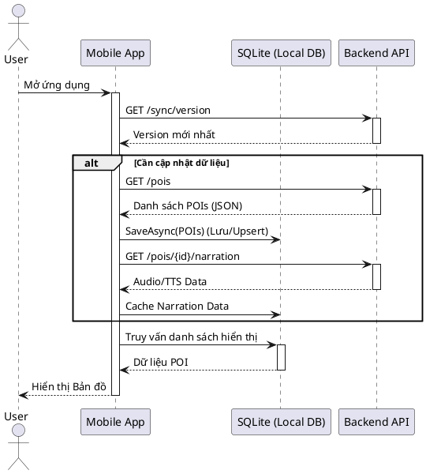

---

## 2. Module 6: Web CMS / Admin

### Activity Diagram
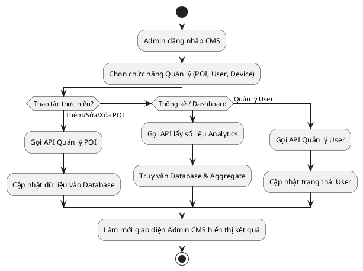

### Sequence Diagram
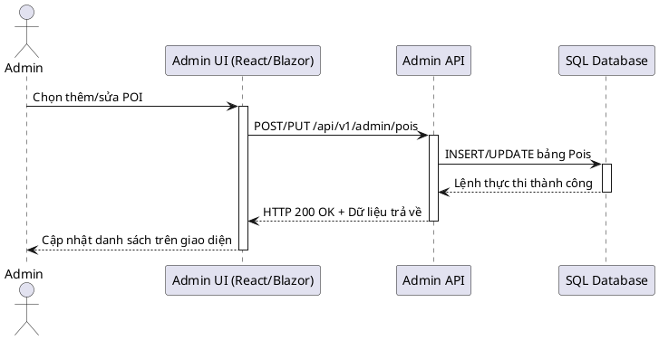

---

## 3. Module 7: Analytics

### Activity Diagram
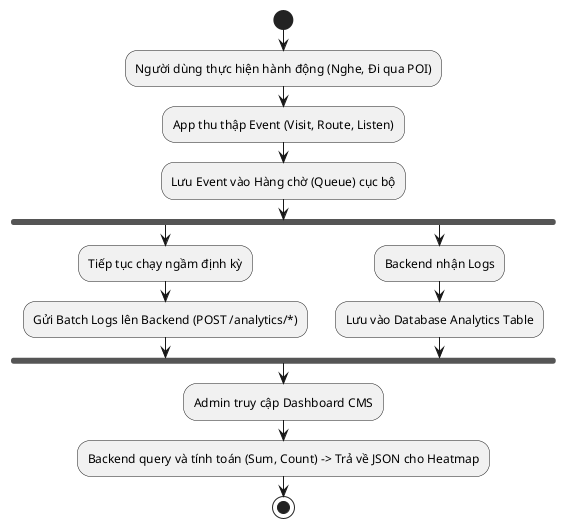

### Sequence Diagram
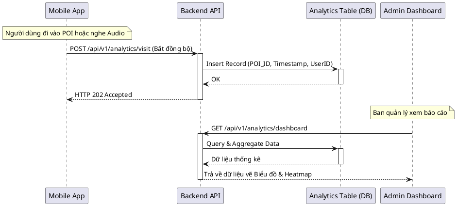

---

## 4. Module 8: QR Trigger

### Activity Diagram
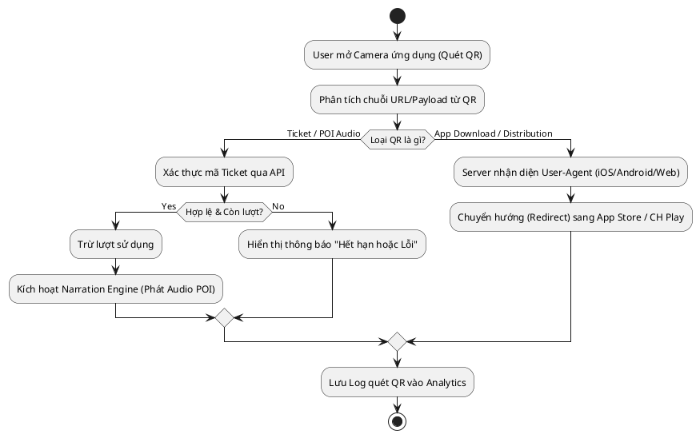

### Sequence Diagram
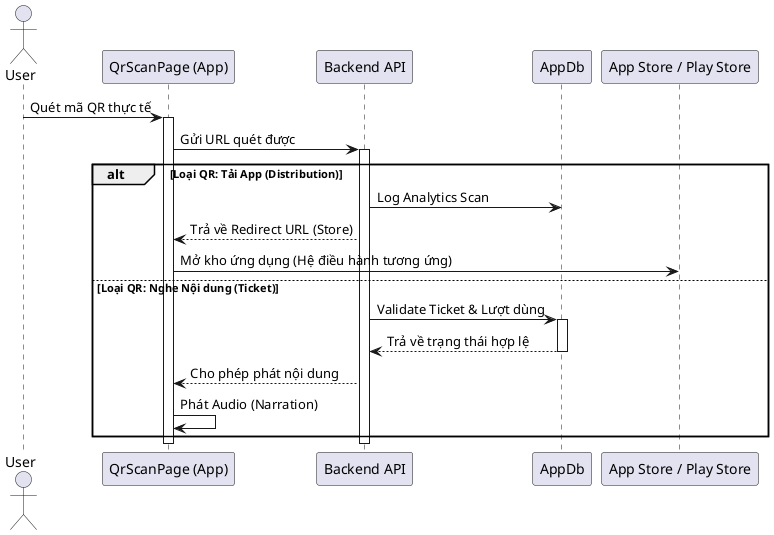

---

## 5. Module 9: Core Workflow Orchestrator

### Activity Diagram
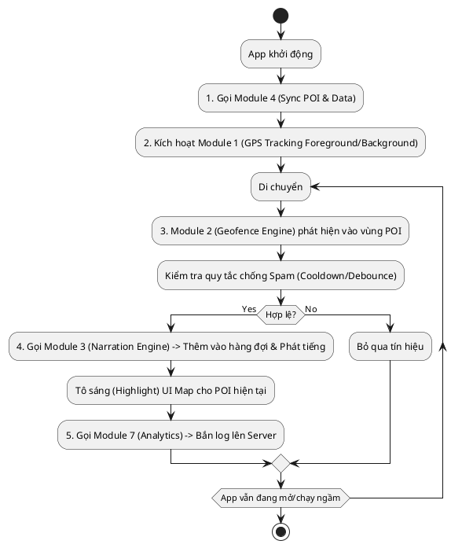

### Sequence Diagram
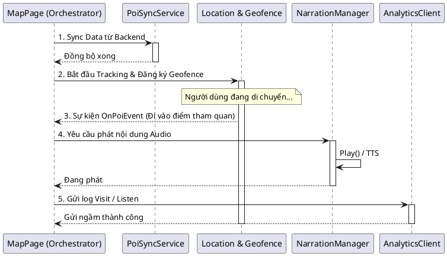

---

## 6. Module 10: Auth + Profile + Plan (FREE/PRO)

### Activity Diagram
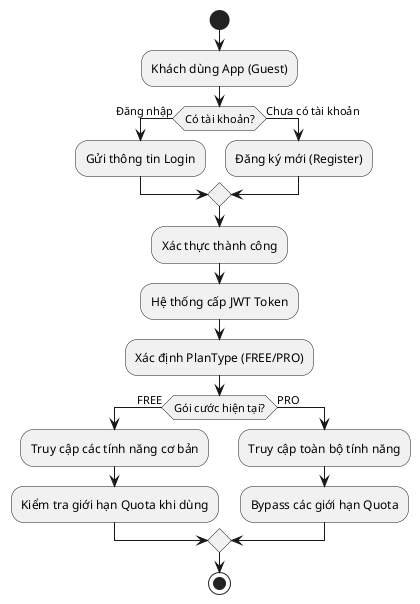

### Sequence Diagram
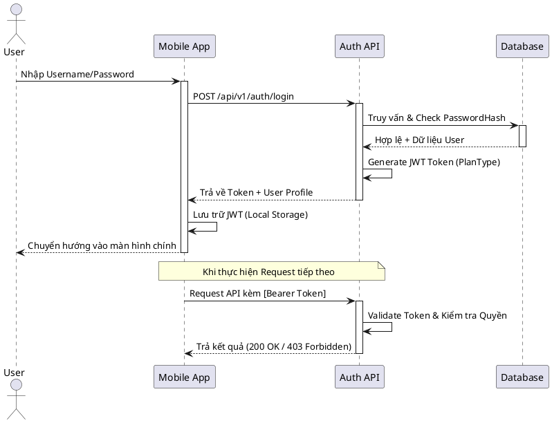

---

## 7. Module 11: Guest Device Presence + Realtime Monitor

### Activity Diagram
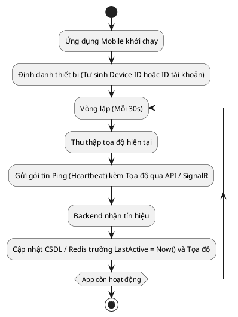

### Sequence Diagram
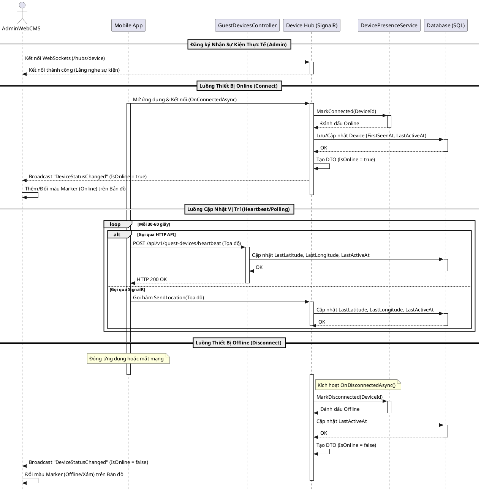

---

## 8. Tổng Quan Hệ Thống

### Sơ Đồ Use Case (Use Case Diagram)
Biểu đồ thể hiện các tác nhân (Actor) và những chức năng (Use Case) chính mà họ tương tác với hệ thống.

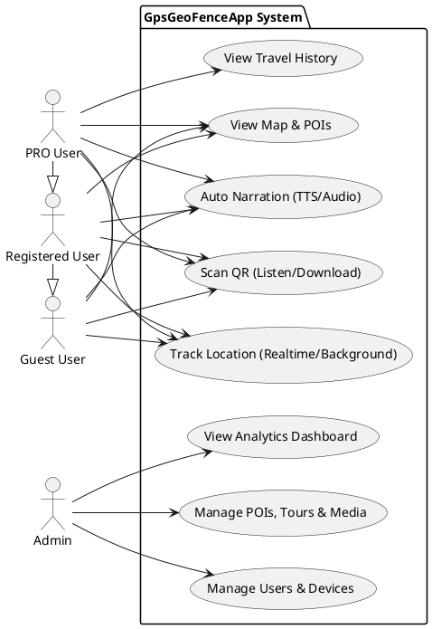

### Sơ Đồ Thực Thể Liên Kết Cơ Sở Dữ Liệu (ERD Diagram)
Biểu đồ ERD được trích xuất dựa trên cấu trúc các thực thể (Entities) của `AppDb.cs` dùng cho hệ thống Backend.

```plantuml
@startuml
!define PRIMARY_KEY(x) <b><color:#b8861b><&key></color> x</b>
!define FOREIGN_KEY(x) <color:#aaaaaa><&key></color> x
!define COLUMN(x) x

entity "Pois" as Pois {
  PRIMARY_KEY(Id) : int
  COLUMN(Name) : nvarchar(200)
  COLUMN(Description) : nvarchar(2000)
  COLUMN(RadiusMeters) : int
  COLUMN(CooldownSeconds) : int
  COLUMN(IsActive) : bit
  COLUMN(CreatedAt) : datetime2
  COLUMN(UpdatedAt) : datetime2
}

entity "PoiLanguage" as PoiLanguage {
  PRIMARY_KEY(IdLang) : int
  FOREIGN_KEY(IdPoi) : int
  COLUMN(LanguageTag) : nvarchar(10)
  COLUMN(TextToSpeech) : nvarchar(4000)
  COLUMN(ProPodcastScript) : nvarchar(max)
  COLUMN(ProAudioUrl) : nvarchar(1000)
}

entity "PoiMedia" as PoiMedia {
  PRIMARY_KEY(Idm) : int
  FOREIGN_KEY(IdPoi) : int
  COLUMN(Image) : nvarchar(1000)
  COLUMN(MapLink) : nvarchar(1000)
}

entity "PoiImage" as PoiImage {
  PRIMARY_KEY(Id) : int
  FOREIGN_KEY(IdPoi) : int
  COLUMN(ImageUrl) : nvarchar(1000)
  COLUMN(SortOrder) : int
  COLUMN(CreatedAt) : datetime2
}

entity "Tours" as Tours {
  PRIMARY_KEY(Id) : int
  COLUMN(Name) : nvarchar(200)
  COLUMN(Description) : nvarchar(2000)
  COLUMN(IsActive) : bit
  COLUMN(CreatedAt) : datetime2
}

entity "TourPois" as TourPois {
  PRIMARY_KEY(TourId) : int <<FK>>
  PRIMARY_KEY(PoiId) : int <<FK>>
  COLUMN(SortOrder) : int
}

entity "Users" as Users {
  PRIMARY_KEY(UserId) : uniqueidentifier
  COLUMN(Username) : nvarchar(100)
  COLUMN(Mail) : nvarchar(200)
  COLUMN(PhoneNumber) : nvarchar(20)
  COLUMN(PasswordHash) : nvarchar(256)
  COLUMN(AvatarUrl) : nvarchar(1000)
  COLUMN(PlanType) : nvarchar(20)
  COLUMN(IsActive) : bit
  COLUMN(CreatedAt) : datetime2
  COLUMN(ProExpiryDate) : datetime2
}

entity "HistoryPoi" as HistoryPoi {
  PRIMARY_KEY(Id) : int
  FOREIGN_KEY(IdPoi) : int
  FOREIGN_KEY(IdUser) : uniqueidentifier
  COLUMN(PoiName) : nvarchar(200)
  COLUMN(Quantity) : int
  COLUMN(LastVisitedAt) : datetime2
}

entity "PoiTickets" as PoiTickets {
  PRIMARY_KEY(TicketCode) : nvarchar(450)
  COLUMN(MaxUses) : int
  COLUMN(CurrentUses) : int
  COLUMN(CreatedAt) : datetime2
}

entity "GuestDevices" as GuestDevices {
  PRIMARY_KEY(DeviceId) : nvarchar(100)
  COLUMN(Platform) : nvarchar(20)
  COLUMN(AppVersion) : nvarchar(20)
  COLUMN(FirstSeenAt) : datetime2
  COLUMN(LastActiveAt) : datetime2
}

entity "DailyUsageTracking" as DailyUsageTracking {
  PRIMARY_KEY(EntityId) : nvarchar(100)
  PRIMARY_KEY(ActionType) : nvarchar(20)
  COLUMN(UsedCount) : int
  COLUMN(LastResetAt) : datetime2
}

entity "SupportedLanguages" as SupportedLanguages {
  PRIMARY_KEY(LanguageTag) : nvarchar(10)
  COLUMN(LanguageName) : nvarchar(50)
  COLUMN(IsPremium) : bit
  COLUMN(IsActive) : bit
}

entity "AppDownloadSources" as AppDownloadSources {
  PRIMARY_KEY(SourceId) : int
  COLUMN(LocationName) : nvarchar(200)
  COLUMN(CampaignCode) : nvarchar(100)
  COLUMN(CreatedAt) : datetime2
}

entity "Analytics_AppDownloadScans" as AnalyticsAppDownloadScans {
  PRIMARY_KEY(Id) : int
  FOREIGN_KEY(SourceId) : int
  COLUMN(Platform) : nvarchar(50)
  COLUMN(ScannedAt) : datetime2
}

' Relationships
Pois ||--o{ PoiLanguage : "1:N"
Pois ||--o{ PoiMedia : "1:N"
Pois ||--o{ PoiImage : "1:N"
Pois ||--o{ HistoryPoi : "1:N"
Users ||--o{ HistoryPoi : "1:N"
Tours ||--o{ TourPois : "1:N"
Pois ||--o{ TourPois : "1:N"
AppDownloadSources ||--o{ AnalyticsAppDownloadScans : "1:N"

@enduml
```
