# Thiết Kế Hệ Thống GpsGeoFenceApp - UML & Workflow

Tài liệu này cung cấp cái nhìn tổng quan và chi tiết về toàn bộ các module trong hệ thống **GpsGeoFenceApp**, đi kèm là các sơ đồ UML (Use Case, Activity, Sequence) được viết bằng định dạng Markdown (Mermaid) để dễ dàng sao chép và hiển thị.

---

## 1. Hệ thống hiện tại có bao nhiêu module?

Hệ thống hiện tại được thiết kế theo kiến trúc tối ưu hóa với tổng cộng **12 module**, chia làm 2 nhóm:
* **9 Module nghiệp vụ chính**: Xử lý các tính năng cốt lõi cho trải nghiệm người dùng cuối (End-user) và luồng dữ liệu chính.
* **3 Module hỗ trợ vận hành**: Quản lý hạn mức, kiểm soát người dùng và giám sát hệ thống.

**Danh sách 9 module nghiệp vụ chính:**
1. GPS Tracking (Realtime + Background)
2. Geofence Engine
3. Narration Engine (TTS/Audio)
4. POI Data Management (Sync + Local DB)
5. Map View (Mobile UI)
6. Web CMS / Admin
7. Analytics
8. QR Trigger (Narration QR + App Download QR)
9. Core Workflow Orchestrator (Sync -> Track -> Detect -> Execute -> Log)

**Danh sách 3 module hỗ trợ vận hành:**
10. Auth + Profile + Plan (FREE/PRO)
11. Guest Device Presence + Realtime Monitor
12. Freemium Usage Gate

---

## 2. Thiết kế Use Case Tổng Quan Hệ Thống

Sơ đồ Use Case tổng quan mô tả các Actor tham gia vào hệ thống và các chức năng (Use Case) chính mà họ có thể thao tác.

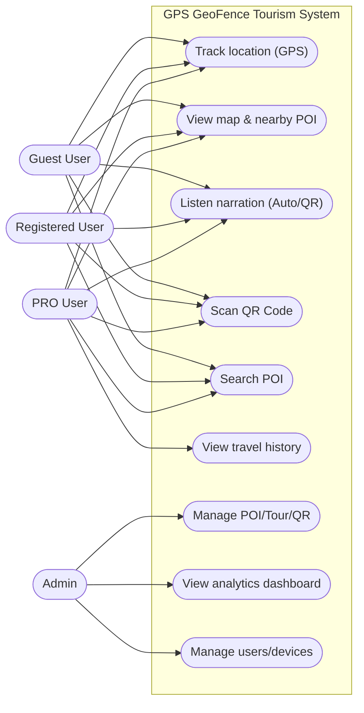

---

## 3. Chi Tiết Từng Module & Thiết Kế UML (Mermaid)

Dưới đây là mô tả, luồng hoạt động và các biểu đồ Activity / Sequence cho từng module trọng tâm.

### Module 1: GPS Tracking

* **Mô tả:** Phân hệ cốt lõi chịu trách nhiệm thu thập vị trí thiết bị liên tục, hoạt động ổn định ở cả trạng thái ứng dụng đang mở (Foreground) và đang thu nhỏ (Background).
* **Luồng hoạt động:**
  1. Ứng dụng xin quyền cấp vị trí từ người dùng.
  2. Bắt đầu tracking khi được cấp quyền.
  3. Khi App bị thu nhỏ (Sleep), chuyển sang chạy Background Service.
  4. Trả tọa độ liên tục cho các module Bản đồ và Geofence.

**Activity Diagram:**
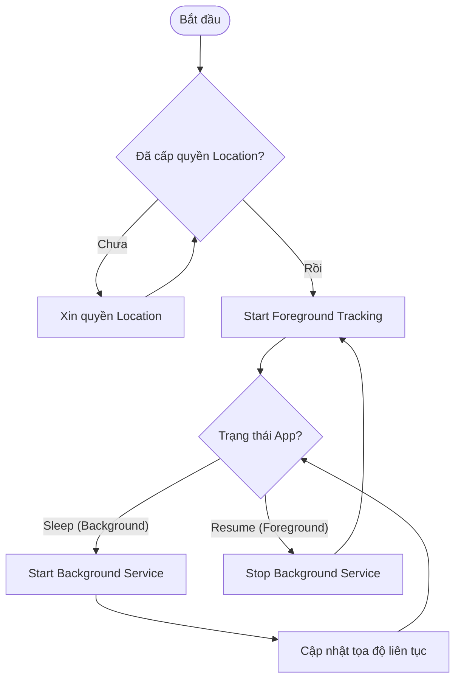

**Sequence Diagram:**
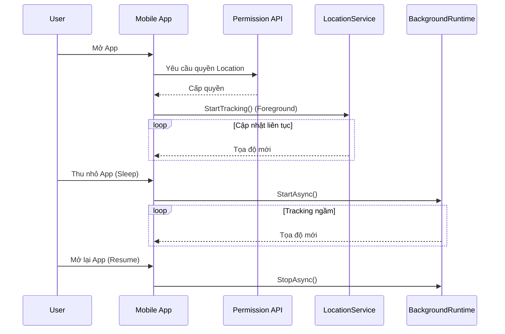

---

### Module 2: Geofence Engine

* **Mô tả:** Động cơ xử lý không gian, tạo "hàng rào ảo" xung quanh các điểm tham quan (POI) để phát hiện khi người dùng bước vào, đi ra hoặc đến gần.
* **Luồng hoạt động:**
  1. Tải danh sách các POI và bán kính (Radius).
  2. Đăng ký thông số này xuống hệ điều hành.
  3. Hệ điều hành bắn ra event khi phát hiện vi phạm hàng rào (Enter/Near).
  4. Hệ thống kiểm tra chống Spam (Cooldown/Debounce) trước khi quyết định kích hoạt sự kiện.

**Activity Diagram:**
```mermaid
flowchart TD
    A([Nhận Location Mới]) --> B[Kiểm tra tọa độ so với danh sách POI]
    B --> C{Xâm nhập vùng POI?}
    C -- "Có (Enter/Near)" --> D[Kích hoạt Event Transition]
    C -- "Không" --> E([Bỏ qua/Đợi])
    D --> F{Kiểm tra Anti-Spam (Cooldown)}
    F -- "Hợp lệ" --> G[Gửi Event kích hoạt UI & Audio]
    F -- "Spam" --> E
```

**Sequence Diagram:**
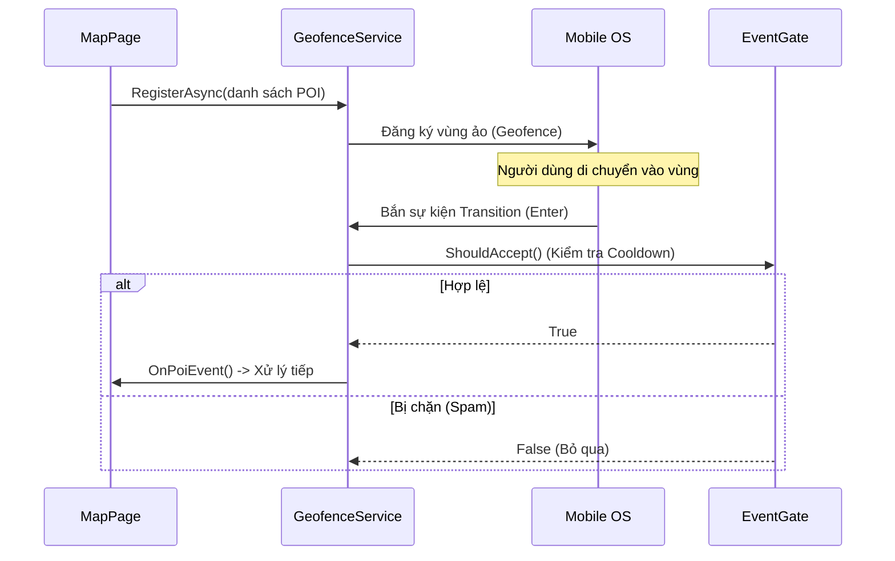

---

### Module 3: Narration Engine (Thuyết minh tự động)

* **Mô tả:** Phân hệ chịu trách nhiệm phát âm thanh hướng dẫn viên (file MP3 tải sẵn hoặc dùng TTS - Text To Speech) khi người dùng đến điểm tham quan.
* **Luồng hoạt động:**
  1. Nhận yêu cầu phát âm thanh.
  2. Đưa vào hàng chờ (Queue) để tránh chồng chéo tiếng.
  3. Kiểm tra xem có file Audio thật không, nếu không sẽ dùng TTS đọc kịch bản.
  4. Phát âm thanh, log lại thời gian nghe thực tế.

**Activity Diagram:**
```mermaid
flowchart TD
    Start([Nhận yêu cầu thuyết minh]) --> EnQ[Thêm vào hàng đợi (Queue)]
    EnQ --> CheckQ{Hàng đợi rỗng?}
    CheckQ -- "Không" --> Worker[Lấy Audio/Text tiếp theo]
    Worker --> CheckFile{Có sẵn file MP3?}
    CheckFile -- "Có" --> PlayAudio[Phát Audio File]
    CheckFile -- "Không" --> TTS[Sử dụng TTS đọc Text]
    PlayAudio --> Log[Log dữ liệu thời gian nghe]
    TTS --> Log
    Log --> CheckQ
    CheckQ -- "Có" --> End([Chờ sự kiện mới])
```

**Sequence Diagram:**
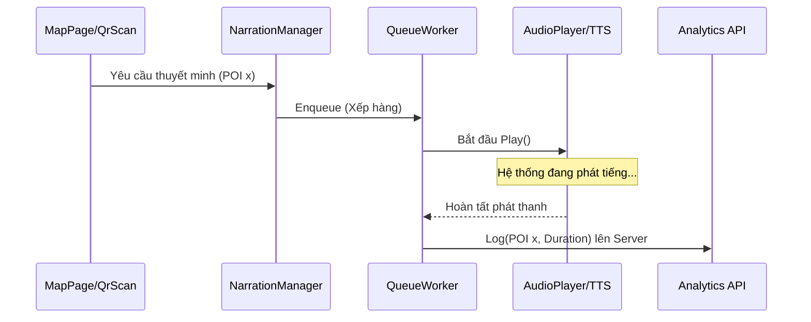

---

### Module 4: POI Data Management

* **Mô tả:** Chịu trách nhiệm đồng bộ và lưu trữ (Offline) toàn bộ dữ liệu về điểm tham quan (Tọa độ, mô tả, hình ảnh, file âm thanh) từ máy chủ xuống.
* **Luồng hoạt động:**
  1. App khởi động, hỏi server xem có phiên bản dữ liệu mới không.
  2. Nếu có, kéo toàn bộ JSON về và lưu vào SQLite (Upsert).
  3. Cung cấp dữ liệu cache cho Map và Narration hoạt động ngay lập tức mà không cần mạng.

**Activity Diagram:**
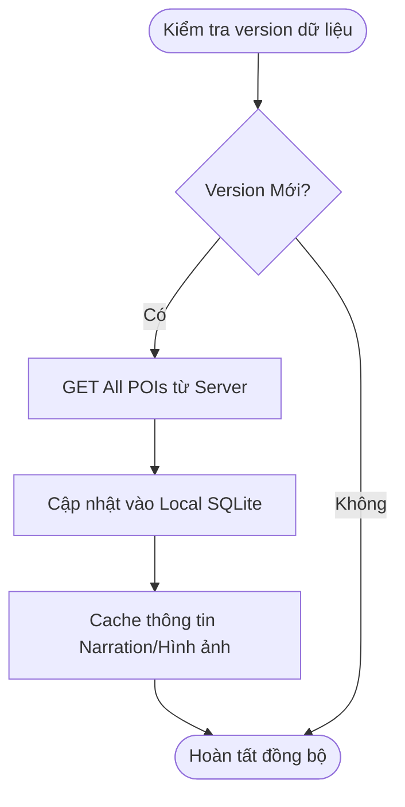

---

### Module 5: Map View

* **Mô tả:** Giao diện bản đồ hiển thị trực quan các điểm tham quan và vị trí của người dùng.
* **Luồng hoạt động:**
  1. Khởi tạo bản đồ, load tất cả POI từ SQLite.
  2. Vẽ Marker và Circle đại diện cho Geofence.
  3. Theo dõi "Chấm xanh" (Blue dot) của User.
  4. Người dùng bấm (Tap) vào Marker để xem chi tiết hoặc hệ thống tự highlight khi lại gần.

**Activity Diagram:**
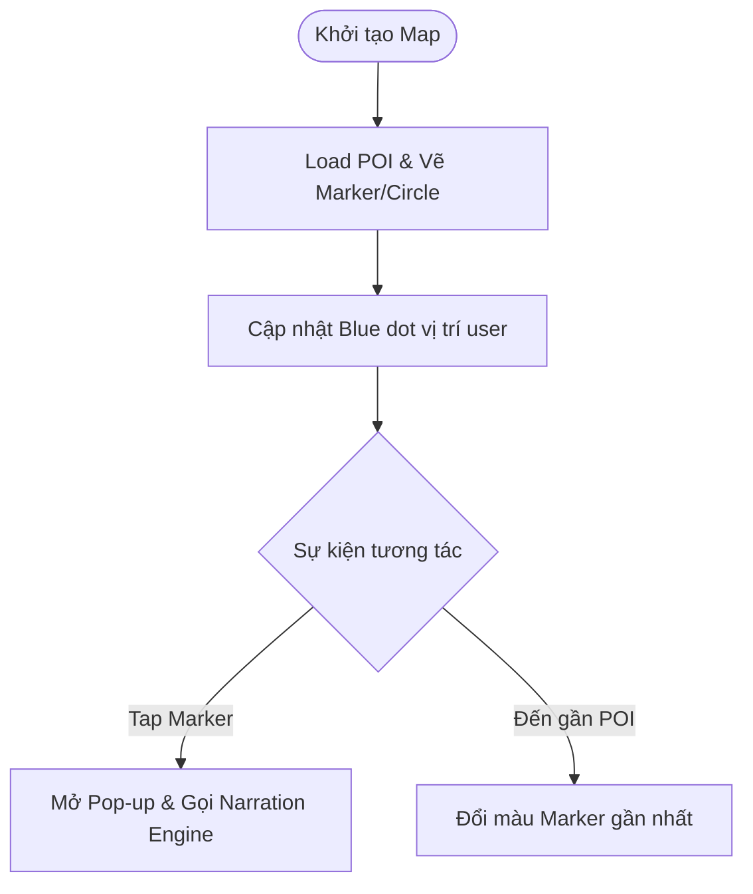

---

### Module 6: Web CMS / Admin

* **Mô tả:** Cổng quản trị dành cho ban quản lý để cập nhật nội dung POI, quản lý User, xem biểu đồ lượng khách.
* **Luồng hoạt động:**
  1. Admin đăng nhập và lấy Token.
  2. Chọn các chức năng thêm/sửa/xóa POI.
  3. Hệ thống Backend ghi nhận và lưu DB.

**Sequence Diagram:**
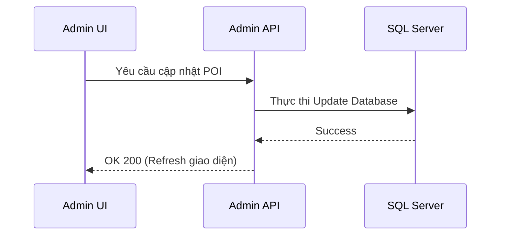

---

### Module 7: Analytics

* **Mô tả:** Thu thập dữ liệu sử dụng một cách âm thầm để vẽ Dashboard và Heatmap (Bản đồ nhiệt) cho Admin.
* **Luồng hoạt động:** Các App sinh ra Log dạng Async (không làm chậm trải nghiệm), sau đó bắn ngầm lên Server để DB tổng hợp.

**Sequence Diagram:**
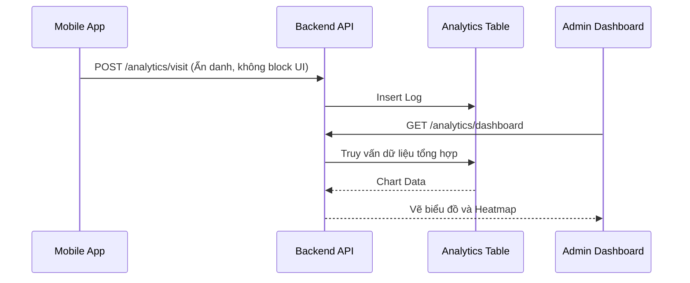

---

### Module 8: QR Trigger

* **Mô tả:** Kích hoạt chức năng Tải App hoặc Nghe Thuyết Minh nhanh thông qua việc dùng Camera quét mã QR dán tại các trạm thực tế.
* **Luồng hoạt động:**
  1. Quét mã QR -> Phân tích.
  2. Nếu là QR Ticket tải nội dung: Check số lượt -> Phát Audio.
  3. Nếu là QR Tải App: Detect hệ điều hành -> Redirect sang CH Play / App Store.

**Activity Diagram:**
```mermaid
flowchart TD
    Scan([Camera quét QR]) --> Parse[Phân tích chuỗi URL/Payload]
    Parse --> CheckType{Phân loại QR}
    CheckType -- "Vé Nghe (Ticket)" --> Verify[Xác thực số lượt sử dụng]
    Verify --> Valid{Hợp lệ?}
    Valid -- "Yes" --> Play[Phát Audio POI]
    Valid -- "No" --> Deny[Cảnh báo hết hạn]
    CheckType -- "Link Tải App" --> Detect[Kiểm tra User-Agent (iOS/Android)]
    Detect --> Redirect[Chuyển hướng vào Store tương ứng]
```

---

### Module 9: Core Workflow Orchestrator

* **Mô tả:** Là luồng kết hợp tất cả các module trên, biến chúng thành vòng lặp tự động (Auto Workflow) hoàn hảo.
* **Luồng hoạt động:** Trình tự diễn ra khi một khách du lịch đi tham quan.

**Activity Diagram:**
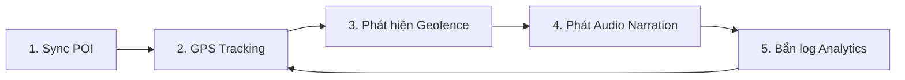

---
### Các Module Hỗ Trợ Vận Hành (Module 10, 11, 12)

Đối với các module hỗ trợ quản trị, hệ thống áp dụng luồng hoạt động đơn giản như sau:

* **Module 10 (Auth & Plan):**
  * Đăng nhập lấy Token -> Check quyền tài khoản -> Cấp quyền sử dụng dựa trên gói (FREE/PRO).
* **Module 11 (Guest Device Presence & Realtime Monitor):**
  * **Mô tả:** Hệ thống theo dõi trạng thái online/offline của thiết bị khách và hiển thị theo thời gian thực trên bản đồ quản trị (Admin CMS).
  * **Luồng hoạt động:**
    1. Ứng dụng Mobile tự tạo Device ID hoặc sử dụng tài khoản để định danh.
    2. Ứng dụng tự động gửi tín hiệu "Ping" (Heartbeat) định kỳ kèm theo tọa độ hiện tại lên Server.
    3. Backend nhận Heartbeat và cập nhật trạng thái hoạt động (Last Active) của thiết bị trong cơ sở dữ liệu hoặc bộ nhớ đệm (Cache/Redis).
    4. Admin CMS lắng nghe luồng dữ liệu này để hiển thị trạng thái "Đang online" cũng như vị trí hiện tại trên bản đồ quản trị.

**Activity Diagram (Module 11):**
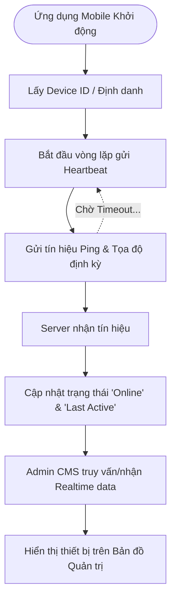

**Sequence Diagram (Module 11):**
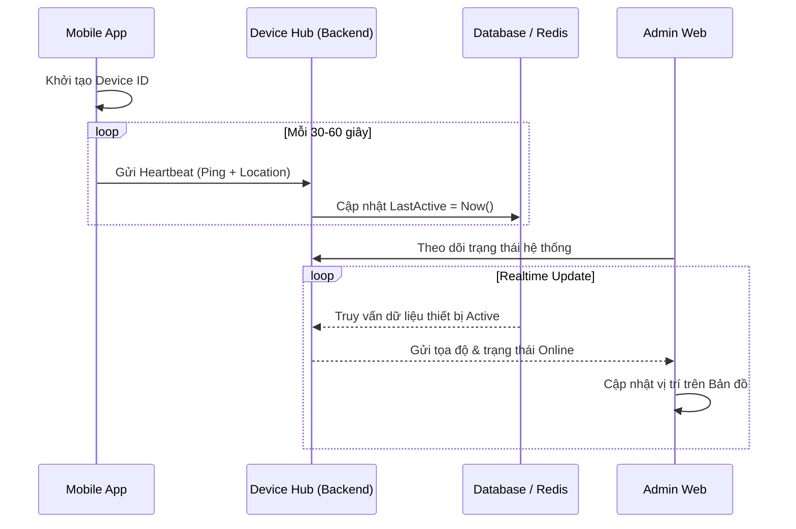
* **Module 12 (Freemium Gate):**
  * Khi User (FREE) chuẩn bị nghe Audio -> Gửi API check giới hạn (Quota) -> Nếu còn lượt: Trừ 1 lượt & Phát Audio; Nếu hết: Bật popup mời mua bản quyền (PRO).

---
*Ghi chú: Toàn bộ các đoạn code Mermaid trên bạn có thể chép thẳng vào bất cứ trình chỉnh sửa Markdown nào có hỗ trợ (như GitHub, GitLab, Obsidian, Notion) hoặc xem trực tiếp trên [Mermaid Live Editor](https://mermaid.live/) để xuất ra hình ảnh.*
