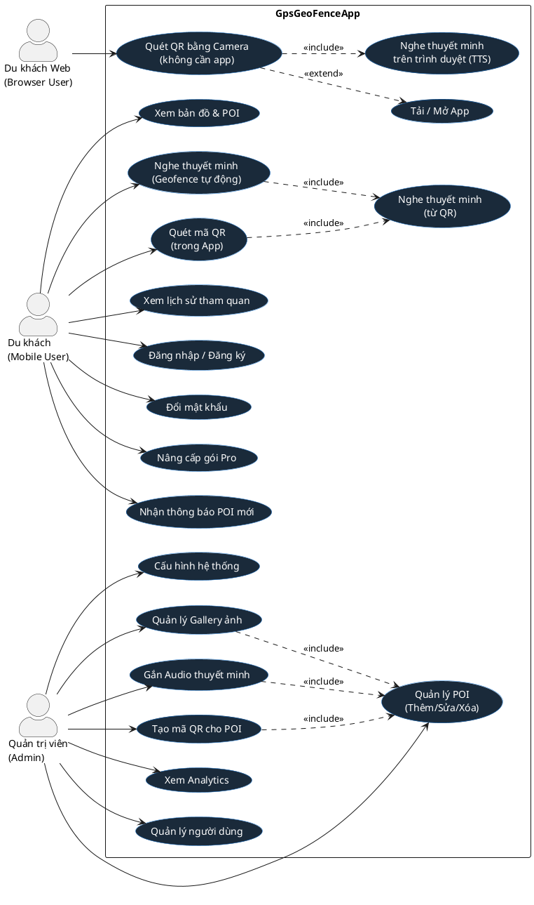
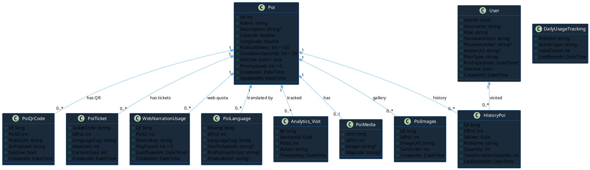
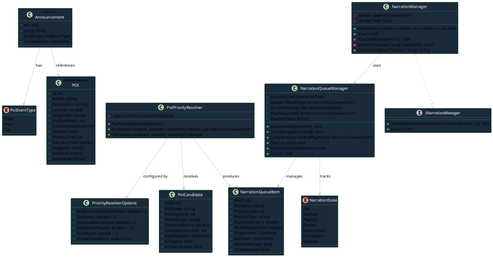
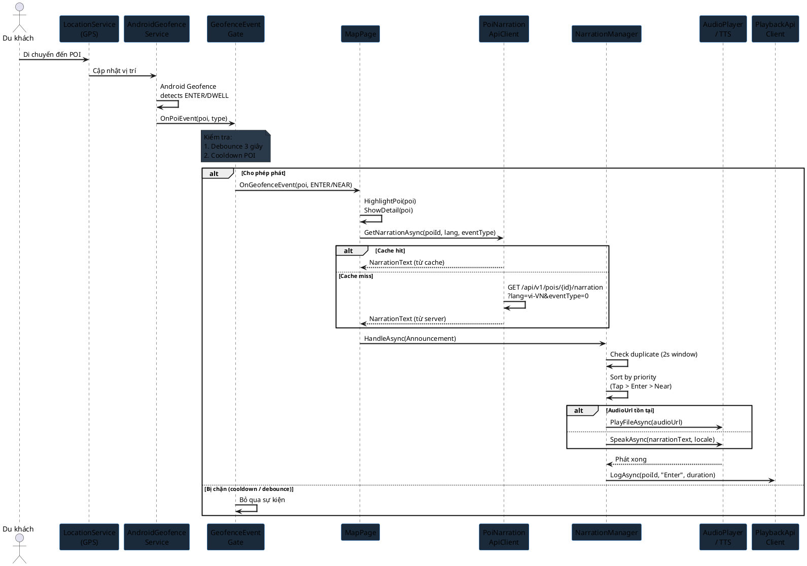
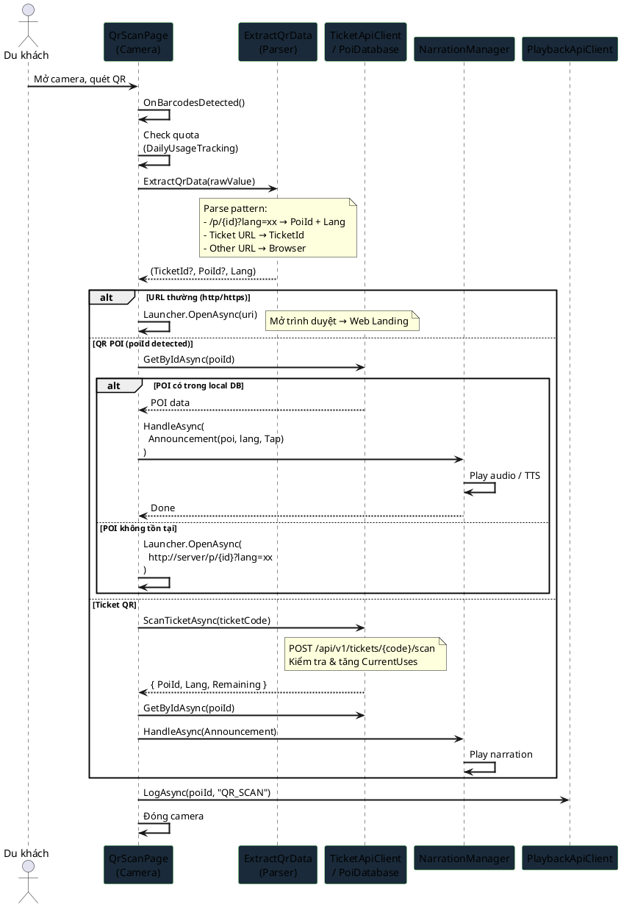
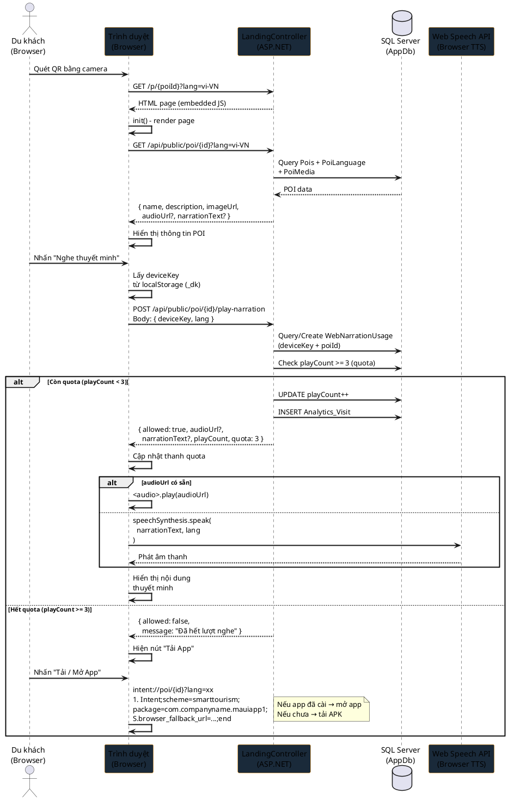
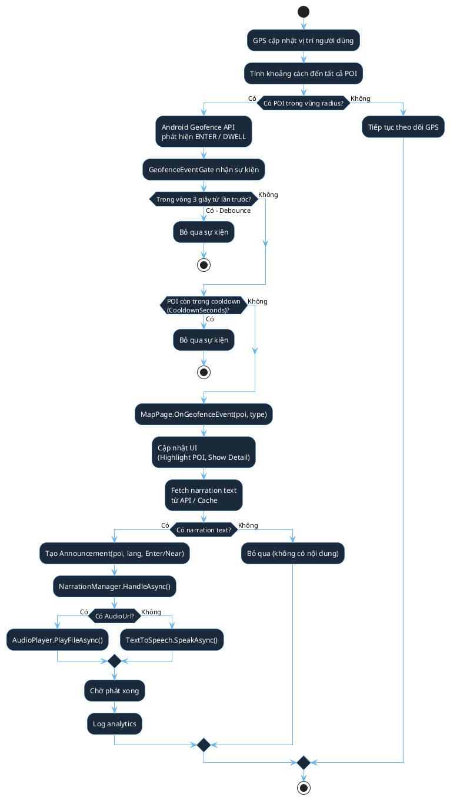
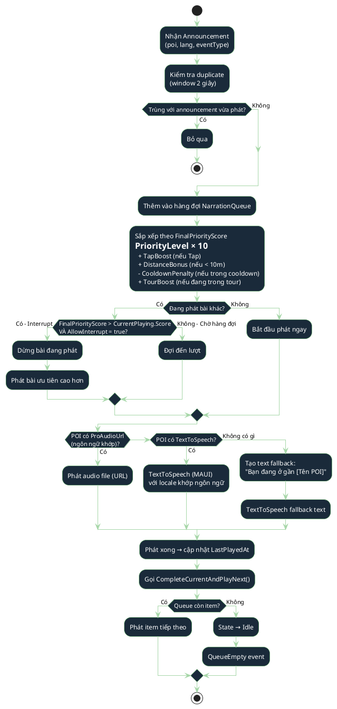
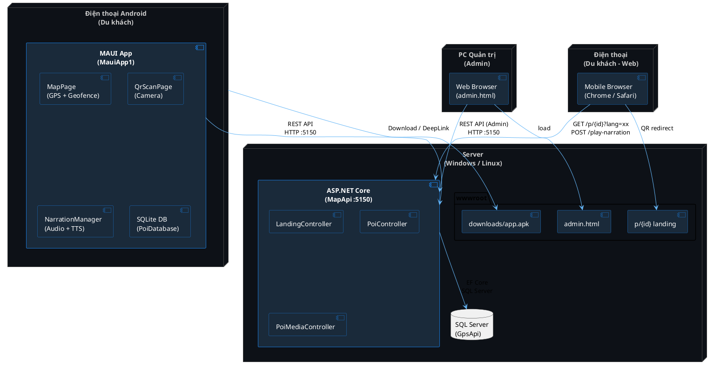

# UML ĐỒ ÁN – GpsGeoFenceApp
# Hệ thống Thuyết minh Du lịch Thông minh theo Vị trí Địa lý

> **Ghi chú**: Tất cả diagram dưới đây được vẽ bằng PlantUML syntax.  
> Render tại: https://www.plantuml.com/plantuml/uml/ hoặc plugin VS Code "PlantUML".

---

## 1. USE CASE DIAGRAM

---

## 2. CLASS DIAGRAM – BACKEND DOMAIN MODEL

---

## 3. CLASS DIAGRAM – MOBILE NARRATION SYSTEM

---

## 4. SEQUENCE DIAGRAM – GEOFENCE → NARRATION

---

## 5. SEQUENCE DIAGRAM – QR SCAN (TRONG APP) → NARRATION

---

## 6. SEQUENCE DIAGRAM – QR SCAN (BROWSER) → WEB LANDING → TTS

---

## 7. ACTIVITY DIAGRAM – GEOFENCE DETECTION FLOW

---

## 8. ACTIVITY DIAGRAM – NARRATION RESOLUTION FLOW

---

## 9. DATABASE ER DIAGRAM

```plantuml
@startuml ERDiagram
skinparam classBackgroundColor #1a2a3a
skinparam classBorderColor #FF9800
skinparam classFontColor white
skinparam arrowColor #FFB74D

entity "Pois" as Pois {
  * Id : int <<PK>>
  --
  Name : nvarchar(200)
  Latitude : float
  Longitude : float
  RadiusMeters : int
  CooldownSeconds : int
  PriorityLevel : int
  IsActive : bit
}

entity "PoiLanguage" as PoiLang {
  * IdLang : bigint <<PK>>
  --
  * IdPoi : int <<FK>>
  LanguageTag : nvarchar(10)
  TextToSpeech : nvarchar(4000)
  ProAudioUrl : nvarchar(1000)
}

entity "PoiMedia" as PoiMedia {
  * Idm : bigint <<PK>>
  --
  * IdPoi : int <<FK>>
  Image : nvarchar(1000)
  MapLink : nvarchar(1000)
}

entity "PoiImages" as PoiImages {
  * Id : bigint <<PK>>
  --
  * IdPoi : int <<FK>>
  ImageUrl : nvarchar(1000)
  SortOrder : int
}

entity "PoiQrCodes" as PoiQr {
  * Id : bigint <<PK>>
  --
  * PoiId : int <<FK>>
  PublicUrl : nvarchar(1000)
  QrPayload : nvarchar(2000)
  IsActive : bit
}

entity "PoiTickets" as Tickets {
  * TicketCode : varchar(50) <<PK>>
  --
  * IdPoi : int <<FK>>
  LanguageTag : nvarchar(10)
  MaxUses : int
  CurrentUses : int
}

entity "WebNarrationUsage" as WebUsage {
  * Id : bigint <<PK>>
  --
  * PoiId : int <<FK>>
  DeviceKey : nvarchar(200)
  PlayCount : int
  LastPlayedAt : datetime2
}

entity "Users" as Users {
  * UserId : uniqueidentifier <<PK>>
  --
  Username : nvarchar(100)
  Mail : nvarchar(200)
  PasswordHash : nvarchar(256)
  PlanType : varchar(20)
  ProExpiryDate : datetime2
}

entity "HistoryPoi" as History {
  * Id : bigint <<PK>>
  --
  * IdPoi : int <<FK>>
  * IdUser : uniqueidentifier <<FK>>
  Quantity : int
  TotalDurationSeconds : int
  LastVisitedAt : datetime2
}

entity "Analytics_Visit" as Analytics {
  * Id : bigint <<PK>>
  --
  * PoiId : int <<FK>>
  Action : nvarchar(20)
  Timestamp : datetime2
}

entity "DailyUsageTracking" as Usage {
  * EntityId : varchar(100) <<PK>>
  * ActionType : varchar(20) <<PK>>
  --
  UsedCount : int
  LastResetAt : datetime2
}

entity "GuestDevices" as Devices {
  * DeviceId : varchar(100) <<PK>>
  --
  Platform : nvarchar(20)
  AppVersion : nvarchar(20)
  LastActiveAt : datetime2
}

Pois ||--o{ PoiLang : "has"
Pois ||--o| PoiMedia : "has"
Pois ||--o{ PoiImages : "gallery"
Pois ||--o{ PoiQr : "has QR"
Pois ||--o{ Tickets : "has"
Pois ||--o{ WebUsage : "web quota"
Pois ||--o{ Analytics : "tracked"
Pois ||--o{ History : "visited"
Users ||--o{ History : "has"

@enduml
```

---

## 10. COMPONENT / DEPLOYMENT DIAGRAM

---

## 11. BẢNG TÓM TẮT CHO BẢO VỆ ĐỒ ÁN

### Công nghệ sử dụng

| Thành phần | Công nghệ | Mục đích |
|---|---|---|
| Mobile App | .NET MAUI (C#) | Cross-platform, Android target |
| Backend API | ASP.NET Core Minimal API | REST endpoints |
| Database | SQL Server + EF Core | Lưu trữ dữ liệu |
| Map | Google Maps SDK | Bản đồ + POI markers |
| Geofence | Android Geofence API | Phát hiện vị trí tự động |
| Audio | MAUI Audio + TTS | Phát thuyết minh |
| Web TTS | Web Speech API | Thuyết minh trên trình duyệt |
| QR Code | ZXing (MAUI) + QRCoder | Tạo và đọc QR |
| Deep Link | Android Intent URL | Mở app từ browser |
| Auth | JWT Bearer Token | Xác thực người dùng |
| Offline | SQLite (local DB) + Sync | Hoạt động không có mạng |
| Notification | NotificationCompat (Android) | Push notification POI mới |

### Chức năng đã triển khai

| # | Chức năng | Trạng thái |
|---|---|---|
| 1 | GPS tracking & Geofence tự động | ✅ Hoàn thành |
| 2 | Phát thuyết minh Audio / TTS | ✅ Hoàn thành |
| 3 | Narration Queue + Priority Engine | ✅ Hoàn thành |
| 4 | QR Code tích hợp (App + Browser) | ✅ Hoàn thành |
| 5 | Web Landing Page (không cần app) | ✅ Hoàn thành |
| 6 | Web Speech API TTS fallback | ✅ Hoàn thành |
| 7 | Deep Link (QR → mở app) | ✅ Hoàn thành |
| 8 | Đa ngôn ngữ (vi, en, ja, ko, de) | ✅ Hoàn thành |
| 9 | Offline-first (SQLite cache) | ✅ Hoàn thành |
| 10 | Analytics (visit, duration, route) | ✅ Hoàn thành |
| 11 | Freemium / Pro plan | ✅ Hoàn thành |
| 12 | Web Admin CMS | ✅ Hoàn thành |
| 13 | Gallery quản lý ảnh POI | ✅ Hoàn thành |
| 14 | Đổi mật khẩu (Profile) | ✅ Hoàn thành |
| 15 | Push Notification POI mới | ✅ Hoàn thành |
| 16 | QR Quota (3 lượt/thiết bị/POI) | ✅ Hoàn thành |
| 17 | APK download + Auto-install | ✅ Hoàn thành |

---

> **Hướng dẫn render**: Copy từng block `@startuml ... @enduml` vào https://www.plantuml.com/plantuml/uml/ để xem diagram.
> Hoặc cài extension **PlantUML** trong VS Code (cần Java + Graphviz).
